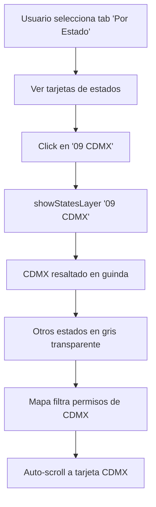
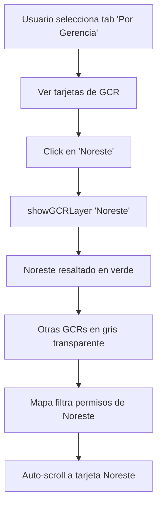
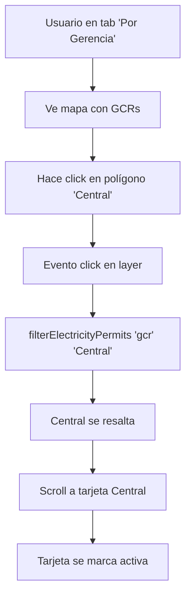
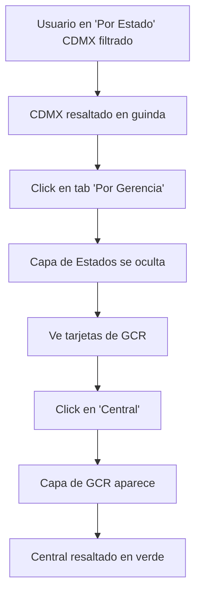

# 🎨 Highlighting de GCR y Estados - Documentación

## Resumen

Se ha implementado un sistema de **highlighting visual** que resalta las Gerencias de Control Regional (GCR) o Estados seleccionados en el mapa, con capas GeoJSON que se activan/desactivan dinámicamente según el filtro aplicado.

---

## 🎯 Funcionalidades Implementadas

### 1. **Highlighting de GCR** 🗺️

**Cuándo se activa:**
- Al filtrar por "Por Gerencia"
- Al hacer click en una tarjeta de GCR
- Al hacer click en una sección de la Vista Detallada
- Al hacer click directamente en el polígono del mapa

**Comportamiento:**
- **GCR Seleccionada**: 
  - Color de relleno: Verde (#1f7a62)
  - Opacidad: 40%
  - Borde: Verde grueso (3px)
  
- **GCRs No Seleccionadas**:
  - Color de relleno: Blanco
  - Opacidad: 5% (casi transparente)
  - Borde: Gris (1px)

**Interactividad:**
- Tooltip verde al pasar el mouse
- Click en polígono → filtra esa GCR
- Auto-scroll a la tarjeta correspondiente

### 2. **Highlighting de Estados** 📍

**Cuándo se activa:**
- Al filtrar por "Por Estado"
- Al hacer click en una tarjeta de Estado
- Al hacer click directamente en el polígono del mapa

**Comportamiento:**
- **Estado Seleccionado**:
  - Color de relleno: Guinda (#601623)
  - Opacidad: 40%
  - Borde: Guinda grueso (3px)
  
- **Estados No Seleccionados**:
  - Color de relleno: Blanco
  - Opacidad: 5%
  - Borde: Gris (1px)

**Interactividad:**
- Tooltip guinda al pasar el mouse
- Click en polígono → filtra ese estado
- Auto-scroll a la tarjeta correspondiente

### 3. **Alternancia Automática de Capas** 🔄

**Lógica:**
```javascript
Filtro "Por Estado" → Muestra capa de Estados, oculta GCR
Filtro "Por Gerencia" → Muestra capa de GCR, oculta Estados
Filtro "Por Tecnología" → Oculta ambas capas
"Ver Todos" → Oculta ambas capas
Cambio de mapa → Oculta ambas capas
```

**Carga bajo demanda:**
- GCR GeoJSON: Se carga al inicio (necesario para análisis espacial)
- Estados GeoJSON: Se carga **solo** la primera vez que se usa "Por Estado"
- Ambos se cachean en memoria para reuso

---

## 🔧 Implementación Técnica

### Variables Globales Agregadas:

```javascript
let statesGeometries = null; // GeoJSON de estados
let gcrLayerGroup = null; // Layer de highlighting de GCR
let statesLayerGroup = null; // Layer de highlighting de Estados
```

### Funciones Nuevas:

#### 1. `showGCRLayer(highlightGCR)`
- Crea capa GeoJSON de gerencias
- Aplica estilos según si está resaltada o no
- Agrega tooltips
- Agrega click handlers
- Usa pane 'gerenciasPane' (z-index 400)

#### 2. `showStatesLayer(highlightState)`
- Carga GeoJSON de estados si no existe
- Delega a `displayStatesLayer()`

#### 3. `displayStatesLayer(highlightState)`
- Crea capa GeoJSON de estados
- Aplica estilos según si está resaltado o no
- Agrega tooltips
- Agrega click handlers
- Mapea nombres de propiedades variables

#### 4. `hideGeometryLayers()`
- Remueve capa de GCR si existe
- Remueve capa de Estados si existe

### Funciones Modificadas:

#### `filterElectricityPermits(type, value)`
Ahora incluye:
```javascript
if (type === 'state') {
    showStatesLayer(value);
} else if (type === 'gcr') {
    showGCRLayer(value);
} else {
    hideGeometryLayers();
}
```

#### `resetElectricityFilters()`
Ahora incluye:
```javascript
hideGeometryLayers();
```

#### `clearData()`
Ahora incluye:
```javascript
hideGeometryLayers();
```

---

## 📊 Estilo de Highlighting

### Estados (GeoJSON):

```javascript
style: {
    // Seleccionado
    fillColor: '#601623',    // Guinda
    fillOpacity: 0.4,
    color: '#601623',
    weight: 3,
    opacity: 1
    
    // No seleccionado
    fillColor: '#ffffff',    // Blanco
    fillOpacity: 0.05,
    color: '#5e6b7e',       // Gris
    weight: 1,
    opacity: 0.3
}
```

### GCR (GeoJSON):

```javascript
style: {
    // Seleccionado
    fillColor: '#1f7a62',    // Verde
    fillOpacity: 0.4,
    color: '#1f7a62',
    weight: 3,
    opacity: 1
    
    // No seleccionado
    fillColor: '#ffffff',    // Blanco
    fillOpacity: 0.05,
    color: '#5e6b7e',       // Gris
    weight: 1,
    opacity: 0.3
}
```

### Tooltips:

```css
.gcr-tooltip {
    background: rgba(31, 122, 98, 0.95);
    border: 2px solid #1f7a62;
    color: white;
    font-weight: 700;
    box-shadow: 0 4px 12px rgba(0, 0, 0, 0.3);
}

.state-tooltip {
    background: rgba(96, 22, 35, 0.95);
    border: 2px solid #601623;
    color: white;
    font-weight: 700;
}
```

---

## 🎨 Efecto Visual

### Antes del Filtro:
```
┌─────────────────────────────────────┐
│                                     │
│   Todas las GCRs/Estados con        │
│   opacidad muy baja (5%)            │
│   Borders grises finos              │
│                                     │
└─────────────────────────────────────┘
```

### Después del Filtro (ejemplo: Noreste):
```
┌─────────────────────────────────────┐
│                                     │
│   ███████  ← NORESTE (Verde 40%)   │
│   ░░░░░░░  ← Otras GCRs (5%)       │
│                                     │
└─────────────────────────────────────┘
```

### Click en el Mapa:
```
1. Usuario hace click en polígono de "Central"
2. Polígono se resalta en verde/guinda
3. Mapa filtra permisos de Central
4. Auto-scroll a tarjeta "Central"
5. Tarjeta se marca como activa
6. Totales se actualizan
```

---

## 🔄 Flujo de Interacción

### Escenario 1: Filtrar por Estado



### Escenario 2: Filtrar por GCR



### Escenario 3: Click Directo en Mapa



### Escenario 4: Cambiar de Tab



---

## 💡 Mapeo de Propiedades de Estados

El GeoJSON de estados puede tener diferentes nombres de propiedades:

```javascript
const stateName = feature.properties.name 
    || feature.properties.NOMGEO 
    || feature.properties.NOM_ENT 
    || feature.properties.estado;
```

**Razón:**
- Diferentes fuentes de GeoJSON usan diferentes convenciones
- El código es flexible para soportar múltiples formatos

---

## ⚡ Optimizaciones

### 1. Carga Lazy de Estados
```javascript
// Estados solo se cargan cuando se usan por primera vez
if (!statesGeometries) {
    fetch('estados.geojson')
        .then(...)
        .catch(...);
}
```

### 2. Caché en Memoria
```javascript
// GCR se carga una vez y se reutiliza
// Estados se carga una vez y se reutiliza
// No se recarga en cada cambio de filtro
```

### 3. Z-Index Correcto
```javascript
// Ambas capas usan 'gerenciasPane' (z-index 400)
// Marcadores usan z-index 650
// Resultado: Polígonos debajo, marcadores arriba
```

### 4. bringToBack()
```javascript
// Asegura que la capa esté detrás de los marcadores
if (gcrLayerGroup) {
    gcrLayerGroup.bringToBack();
}
```

---

## 📈 URLs de GeoJSON

### GCR (Gerencias de Control Regional):
```
https://cdn.sassoapps.com/Mapas/Electricidad/gerenciasdecontrol.geojson
```

**Estructura esperada:**
```json
{
    "type": "FeatureCollection",
    "features": [{
        "type": "Feature",
        "properties": {
            "name": "Noreste",
            "id": 6
        },
        "geometry": {
            "type": "MultiPolygon",
            "coordinates": [...]
        }
    }]
}
```

### Estados:
```
https://cdn.sassoapps.com/Mapas/Electricidad/estados.geojson
```

**Estructura esperada:**
```json
{
    "type": "FeatureCollection",
    "features": [{
        "type": "Feature",
        "properties": {
            "name": "Chiapas",
            // O: "NOMGEO", "NOM_ENT", "estado"
        },
        "geometry": {
            "type": "Polygon",
            "coordinates": [...]
        }
    }]
}
```

---

## ✅ Checklist de Funcionalidad

- [x] Capa de GCR se muestra al filtrar por gerencia
- [x] Capa de Estados se muestra al filtrar por estado
- [x] GCR seleccionada se resalta en verde
- [x] Estado seleccionado se resalta en guinda
- [x] No seleccionados quedan en gris transparente
- [x] Click en polígono filtra
- [x] Auto-scroll a tarjeta correspondiente
- [x] Tooltips funcionan
- [x] Capas se ocultan al cambiar de filtro
- [x] Capas se ocultan al resetear
- [x] Capas se ocultan al cambiar de mapa
- [x] Estados se cargan solo cuando se necesitan
- [x] Ambas capas se cachean para reuso
- [x] Marcadores siempre visibles sobre polígonos

---

## 🎉 Resultado Final

El usuario ahora tiene:

1. **Feedback Visual Claro**: Ve exactamente qué región está filtrando
2. **Interacción Intuitiva**: Click en el mapa para filtrar
3. **Rendimiento Óptimo**: Capas se cargan una vez y se reutilizan
4. **Experiencia Fluida**: Transiciones suaves entre capas
5. **Colores Institucionales**: Verde para GCR, Guinda para Estados

---

**Fecha de Implementación**: 10 de Noviembre, 2025  
**Versión**: 3.1.0  
**Estado**: ✅ COMPLETADO Y FUNCIONAL
