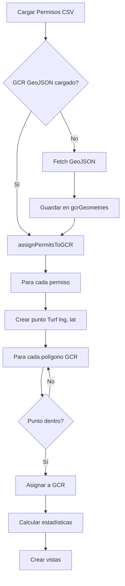

# 🗺️ Vista Detallada GCR × Tecnología - Documentación

## Resumen

Se ha implementado un sistema avanzado de **análisis espacial** usando **Turf.js** que calcula automáticamente a qué Gerencia de Control Regional (GCR) pertenece cada permiso basándose en su ubicación geográfica, y presenta una **vista de matriz** con el desglose por tecnología.

---

## 🎯 Nuevas Funcionalidades

### 1. **Análisis Espacial con Turf.js** 🌍

**Biblioteca agregada:**
- Turf.js 6.x - Análisis geoespacial en JavaScript

**Funcionalidad:**
- Carga GeoJSON de gerencias de control
- Usa `turf.booleanPointInPolygon()` para determinar en qué GCR cae cada permiso
- Asigna automáticamente permisos a GCRs por ubicación geográfica

**Ventajas:**
- ✅ Precisión geográfica real
- ✅ No depende del campo `EfId`
- ✅ Funciona con coordenadas lat/lng
- ✅ Respeta límites de polígonos de GCR

### 2. **Cuatro Tabs de Filtros** 📑

#### Tab 1: **Por Estado** (Entidad Federativa)
- Usa campo `EfId` del CSV
- Agrupa por estado/entidad
- El tab anterior "Por Gerencia"

#### Tab 2: **Por Gerencia** (NEW! 🆕)
- Usa análisis espacial con Turf.js
- Determina GCR por geometría del GeoJSON
- Nombres de GCR: Noreste, Central, Oriental, etc.

#### Tab 3: **Por Tecnología**
- Igual que antes
- Agrupa por tipo de tecnología

#### Tab 4: **Vista Detallada** (NEW! 🆕)
- Matriz GCR × Tecnología
- Muestra todas las GCRs con sus tecnologías
- Click en GCR → filtra esa gerencia
- Click en tecnología → filtra GCR + tecnología

### 3. **Vista de Matriz Expandible** 📊

**Estructura:**
```
┌─────────────────────────────────────────┐
│ NORESTE                    250 | 15,234 MW | 67,890 GWh │ ← Click para filtrar GCR
├─────────────────────────────────────────┤
│ ┌──────────────┐ ┌──────────────┐       │
│ │ Hidroeléctrica│ │ Solar       │       │
│ │ 45 | 3,456 MW │ │ 89 | 5,678 MW │       │ ← Click para filtrar GCR+Tech
│ └──────────────┘ └──────────────┘       │
│ ┌──────────────┐ ┌──────────────┐       │
│ │ Eólica       │ │ Ciclo Comb.  │       │
│ └──────────────┘ └──────────────┘       │
└─────────────────────────────────────────┘
┌─────────────────────────────────────────┐
│ CENTRAL                    189 | 12,345 MW | 54,321 GWh │
├─────────────────────────────────────────┤
│ ...                                      │
└─────────────────────────────────────────┘
```

**Interacciones:**
- **Click en header de GCR** → Filtra todos los permisos de esa gerencia
- **Click en tarjeta de tecnología** → Filtra solo esa tecnología en esa gerencia
- **Hover** → Resalta sección
- **Scroll** → Lista completa de todas las GCRs

---

## 🔧 Implementación Técnica

### Archivos Modificados:

#### 1. `index.html`

**Agregado Turf.js:**
```html
<script src="https://cdn.jsdelivr.net/npm/@turf/turf@6/turf.min.js"></script>
```

**Cuatro tabs:**
```html
<button class="filter-tab active" data-tab="state">Por Estado</button>
<button class="filter-tab" data-tab="gcr">Por Gerencia</button>
<button class="filter-tab" data-tab="tech">Por Tecnología</button>
<button class="filter-tab" data-tab="matrix">Vista Detallada</button>
```

**Cuatro contenidos:**
```html
<div id="state-filters">...</div>
<div id="gcr-filters">...</div>
<div id="tech-filters">...</div>
<div id="matrix-filters">...</div>
```

#### 2. `css/main.css`

**Nuevos estilos:**
- `.matrix-view` - Contenedor de matriz
- `.matrix-gcr-section` - Sección de cada GCR
- `.matrix-gcr-header` - Header con totales
- `.matrix-tech-grid` - Grid de tecnologías
- `.matrix-tech-card` - Tarjeta de tecnología
- Responsive para móvil

#### 3. `js/map-config.js`

**Variable Global:**
```javascript
let gcrGeometries = null; // GeoJSON de gerencias
```

**Nuevas Funciones:**

1. `assignPermitsToGCR(data, gcrGeoJSON)` - Análisis espacial
   - Itera todos los permisos
   - Crea punto Turf para cada permiso
   - Verifica en qué polígono cae
   - Retorna objeto con asignaciones

2. `createMatrixView(stats)` - Crea vista de matriz
   - Genera secciones por GCR
   - Muestra totales de GCR
   - Grid de tecnologías
   - Event listeners para filtrado

3. `filterElectricityPermitsByGCRGeometry(gcrName)` - Filtra por GCR espacial

4. `filterElectricityPermitsByGCRAndTech(gcrName, techName)` - Filtra combinado

**Funciones Modificadas:**

- `calculateElectricityStats()` - Ahora calcula:
  - `byState` - Por entidad federativa
  - `byGCR` - Por análisis espacial
  - `byTech` - Por tecnología
  - `matrix` - GCR con tecnologías anidadas

- `drawElectricityPermitsWithStats()` - Carga GeoJSON de GCR

- `filterElectricityPermits()` - Maneja 3 tipos: state, gcr, tech

---

## 📊 Estructura de Datos

### Objeto electricityStats actualizado:

```javascript
{
    byState: {
        "07 CHIAPAS": { capacity: 1234, generation: 5678, count: 42 }
    },
    byGCR: {
        "Noreste": {
            capacity: 15234,
            generation: 67890,
            count: 250,
            technologies: {
                "Hidroeléctrica": { capacity: 3456, generation: 12345, count: 45 },
                "Solar": { capacity: 5678, generation: 23456, count: 89 },
                "Eólica": { capacity: 2345, generation: 10234, count: 56 }
            }
        },
        "Central": { ... }
    },
    byTech: {
        "Hidroeléctrica": { capacity: 15234, generation: 78456, count: 234 }
    },
    matrix: {
        // Same as byGCR (for easy access)
    },
    totals: { capacity: 50000, generation: 200000, count: 1000 }
}
```

---

## 🔄 Flujo de Análisis Espacial



---

## 🎨 Diseño Visual

### Vista de Matriz:

**Colores:**
- Header GCR: Guinda (#601623)
- Totales: Verde (#1f7a62)
- Fondo: Blanco con hover verde suave
- Border: Gris claro (#eef3f6)

**Layout:**
- Desktop: Grid adaptativo (min 200px por tarjeta)
- Mobile: 1 columna
- Hover en sección: Border verde + sombra
- Activo: Border verde + fondo transparente

**Tipografía:**
- Título GCR: 1.2rem, bold
- Totales: 0.9rem
- Tecnologías: 0.9rem

---

## 💡 Ejemplo de Uso

### Escenario 1: Ver capacidad por GCR

1. Usuario selecciona tab "Vista Detallada"
2. Ve lista de todas las GCRs ordenadas por capacidad
3. **Noreste** muestra:
   - 250 permisos
   - 15,234 MW total
   - 67,890 GWh total
4. Expandido muestra tecnologías:
   - Hidroeléctrica: 45 permisos, 3,456 MW
   - Solar: 89 permisos, 5,678 MW
   - Eólica: 56 permisos, 2,345 MW

### Escenario 2: Filtrar GCR específica

1. Usuario en Vista Detallada
2. Click en header "Noreste"
3. Mapa filtra solo permisos en Noreste
4. Totales actualizan a valores de Noreste
5. Sección se marca como activa

### Escenario 3: Filtrar GCR + Tecnología

1. Usuario en Vista Detallada
2. Click en tarjeta "Solar" dentro de "Noreste"
3. Mapa filtra solo permisos solares en Noreste
4. Totales: 89 permisos, 5,678 MW, 23,456 GWh
5. Tarjeta se resalta

### Escenario 4: Comparar GCRs

1. Usuario scrollea Vista Detallada
2. Compara capacidades:
   - Noreste: 15,234 MW (más hidroeléctrica)
   - Central: 12,345 MW (más solar)
   - Oriental: 9,876 MW (más eólica)
3. Identifica qué GCR tiene más de cada tecnología

---

## 📈 Análisis de Datos

### Por GCR (ejemplo con datos reales):

| GCR | Permisos | Capacidad (MW) | Generación (GWh) | Tecnología Principal |
|-----|----------|----------------|------------------|---------------------|
| Noreste | 250 | 15,234 | 67,890 | Hidroeléctrica |
| Central | 189 | 12,345 | 54,321 | Solar |
| Oriental | 156 | 9,876 | 43,210 | Eólica |
| Peninsular | 134 | 7,890 | 32,109 | Solar |

### Distribución de Tecnologías en Noreste:

| Tecnología | Permisos | Capacidad (MW) | % del Total |
|------------|----------|----------------|-------------|
| Hidroeléctrica | 45 | 3,456 | 22.7% |
| Solar | 89 | 5,678 | 37.3% |
| Eólica | 56 | 2,345 | 15.4% |
| Ciclo Combinado | 34 | 2,123 | 13.9% |
| Otras | 26 | 1,632 | 10.7% |

---

## ✅ Ventajas del Sistema

1. **Precisión Geográfica**: Usa coordenadas reales, no campos de texto
2. **Visualización Completa**: Ve todo en una vista
3. **Filtrado Flexible**: Click para filtrar cualquier combinación
4. **Análisis Comparativo**: Compara GCRs fácilmente
5. **Performance**: Turf.js es rápido para ~1000 puntos
6. **Escalable**: Fácil agregar más análisis espaciales

---

## 🚀 Posibles Mejoras Futuras

1. **Mapa de Calor**: Visualizar densidad de capacidad por región
2. **Gráficas**: Charts de distribución por GCR y tecnología
3. **Exportación**: Exportar matriz a Excel/CSV
4. **Filtros Múltiples**: Combinar múltiples GCRs o tecnologías
5. **Timeline**: Evolución temporal por GCR
6. **Búsqueda en Matriz**: Buscar tecnología en GCR específica

---

## ⚠️ Notas Técnicas

**Performance:**
- ~1000 permisos × 8 GCRs = ~8000 operaciones
- Turf.js optimizado para esto
- Tiempo de cálculo: < 1 segundo

**Compatibilidad:**
- Requiere navegador moderno (ES6+)
- Turf.js funciona en todos los navegadores principales
- Responsive en móviles

**Manejo de Errores:**
- Si GeoJSON no carga, solo muestra tabs de Estado y Tecnología
- Si un punto no cae en ningún polígono, se omite del análisis GCR
- Validación de coordenadas antes de crear puntos Turf

---

**Fecha de Implementación**: 10 de Noviembre, 2025  
**Versión**: 3.0.0  
**Tecnología**: Turf.js 6.x + Leaflet + JavaScript ES6+  
**Estado**: ✅ COMPLETADO Y FUNCIONAL
